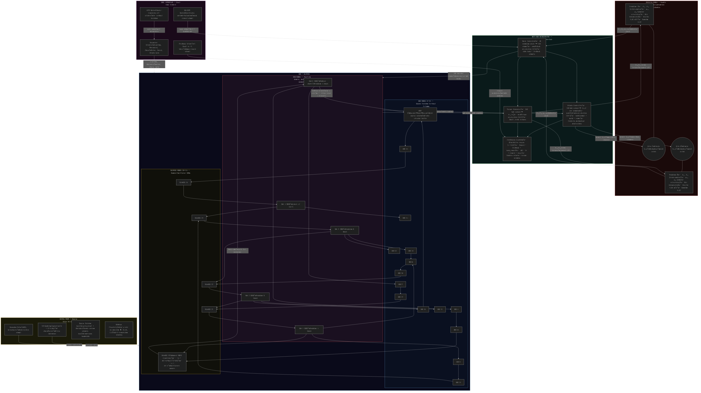

# Recursive BDH + DLINOSS Constellation

A recursive neuromorphic simulation: 20 BDH (Baby Dragon Hatchling) nodes and 5 Damped-LinOSS oscillators wired in a Barabási-Albert scale-free graph. The constellation brain juggles the pivot points of two double pendulums with real physics (Lagrangian + RK4). Continuous Hebbian + reward-based learning from human feedback.

## Architecture



See [docs/arch.mermaid](docs/arch.mermaid) for the full source.

**Live demo:** [springyworks.github.io/recursiveBDH](https://springyworks.github.io/recursiveBDH/)

## Demo GIF


## Run locally

```bash
# clone & serve
git clone https://github.com/springyworks/recursiveBDH.git
cd recursiveBDH/docs
python3 -m http.server 8765
# open http://localhost:8765
```

### Python version (matplotlib + TensorBoard)

```bash
cd recursiveBDH
python3 -m venv .venv && source .venv/bin/activate
pip install -r requirements.txt
python main.py
```

## Controls

| Control | What it does |
|---------|-------------|
| **Coupling** | Edge signal strength between nodes |
| **Threshold** | Sparse pulsing gate — higher = quieter |
| **Chaos** | VCO babbling amplitude |
| **Noise** | Random input injection |
| **Speed** | Simulation steps per frame |
| **Org.Gain** | How aggressively the brain moves pendulum pivots |
| **BALANCE** | Task: try to invert pendulums (balance to top) |
| **AUTO** | Auto-regulation: the brain tunes all sliders itself |
| **Feedback** | Human reward signal: left = bad, right = nice |

> Hover the **?** icons next to each control in the web app for detailed explanations.
